# 📚🇯🇵 MyJLPT Account ဖွင့်နည်း

ဂျပန်မှာ JLPT စာမေးပွဲဖြေမယ့်သူတွေအတွက် MyJLPT Account အရင်ဖွင့်ထားဖို့ လိုပါတယ်။

ဒီတစ်ခါမှာတော့ MyJLPT Account ဘယ်လိုဖွင့်ရမလဲ ဆိုတာ Step by Step မြန်မာလို ရှင်းပြပေးထားပါတယ်👇

## Step ①

Official JLPT Website ကိုဝင်ပါ။

https://www.jlpt.jp/

## Step ②

အောက်ပါ ပုံတွင်ပြထားသည့်အတိုင်း 日本で受験する ကို နှိပ်ပါ။

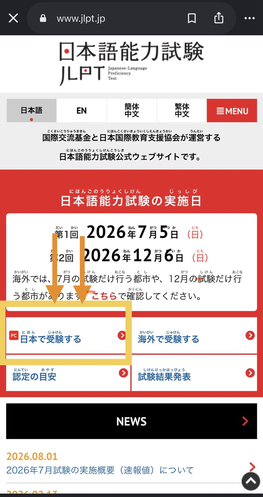

## Step ③

အောက်ဘက်ကို အနည်းငယ် scroll လေးဆွဲ၍ My JLPG IDに登録 ကို နှိပ်ပါ။

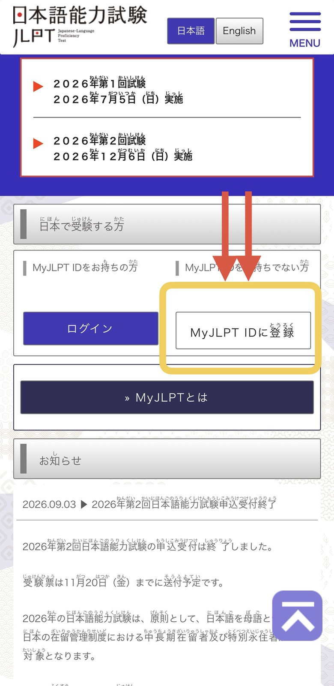

## Step ④

အောက်ပါ ပုံတွင်ပြထားသည့်အတိုင်း တစ်ဦးချင်းဖြစ်သည့်အတွက် 個人 ကိုရွေးချယ်ပါ။

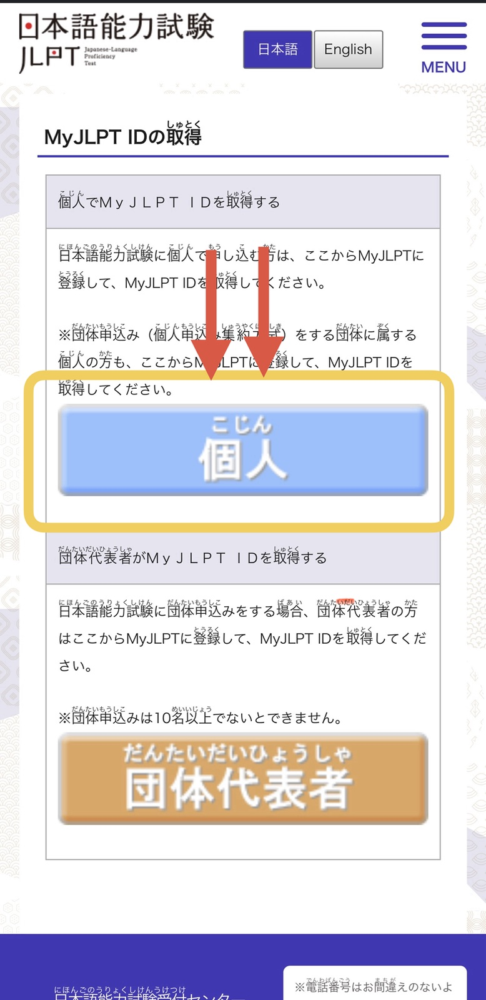

## Step ⑤

ဘာသာစကားရွေးချယ်ပါ။ မင်မင်ကတော့ ဂျပန်ဘာသာပဲ ရွေးထားပါတယ်။

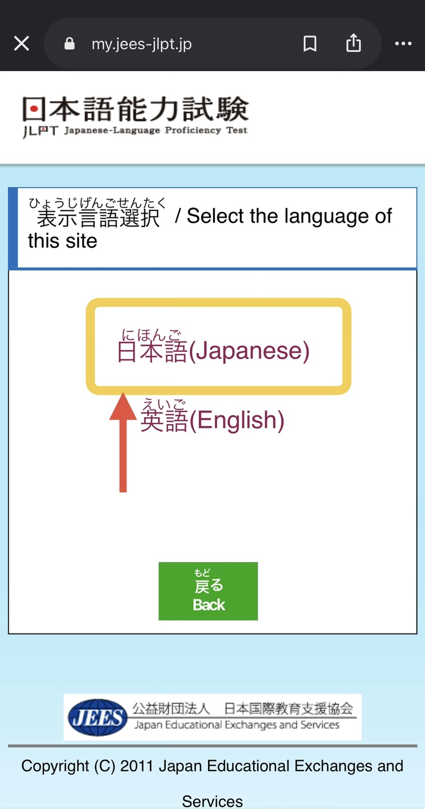

## Step ⑥

MyJLPTအသုံးပြုနည်းစည်းမျဉ်းများကို သဘောတူကြောင်း 同意する ကိုနှိပ်ပါ။

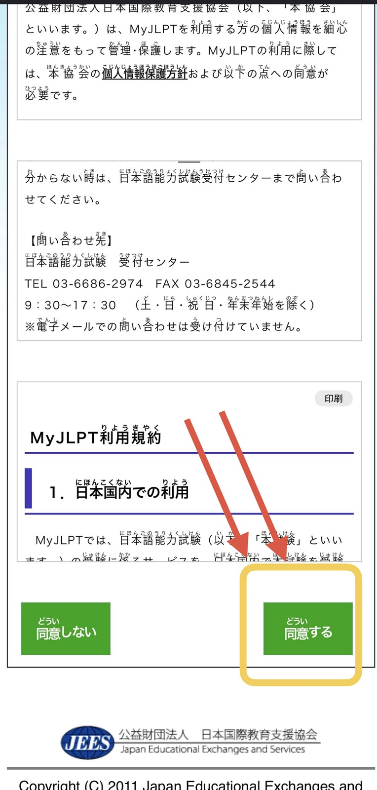

## Step ⑦

ဤ Step မှစ၍ ကိုယ်ရေးအချက်အလက်များဖြည့်သွင်းရပါမည်။ ပထမဦးမှာ မိမိအမည်ကို အင်္ဂလိပ်လို စာလုံးအကြီးများဖြင့် Zairyuu Card အတိုင်းရိုက်ထည့်ပါ။

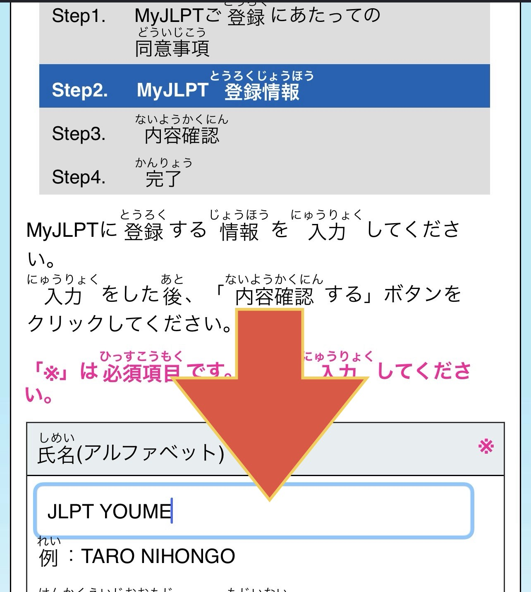

## Step ⑧-1

မွေးဖွားရာဒေသ၊ မိခင်ဘာသာစကား၊ ကျားမ တို့ကိုရွေးချယ်ပါ။

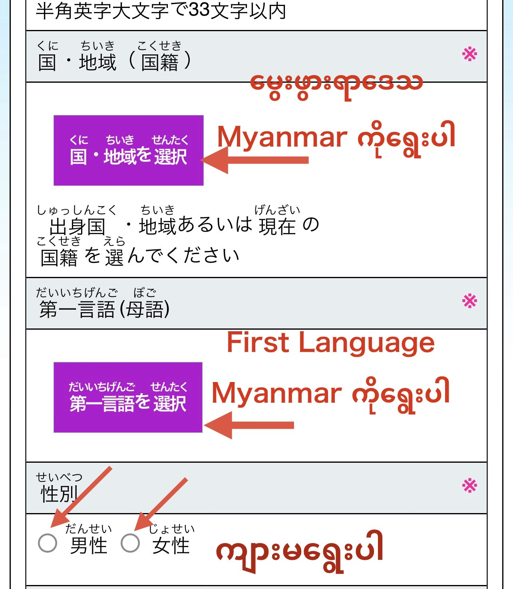

## Step ⑧-2

မွေးဖွားရာဒေသနှင့် မိခင်ဘာသာစကားကိုဖြည့်ရာတွင် ပန်းရောင်ခလုတ်လေးကို နှိပ်လိုက်ပါက ရွေးချယ်စရာပေါ်လာပါမည်။
ပေါ်လာပါက Myanmar ကို ရွေးချယ်ပါ။

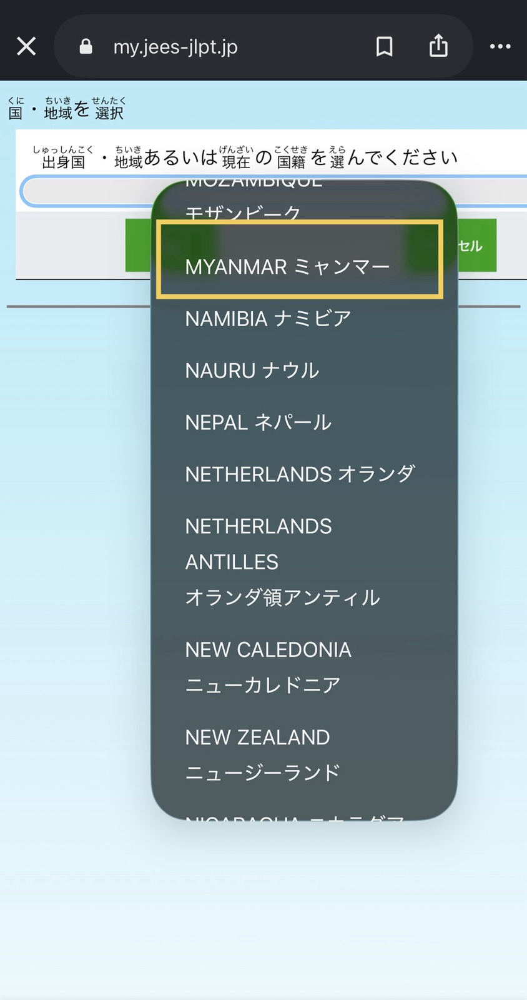

## Step ⑧-3

Myanmar ကိုရွေးချယ်ပြီးပါက 決定 ခလုတ်ကိုနှိပ်ပါ။

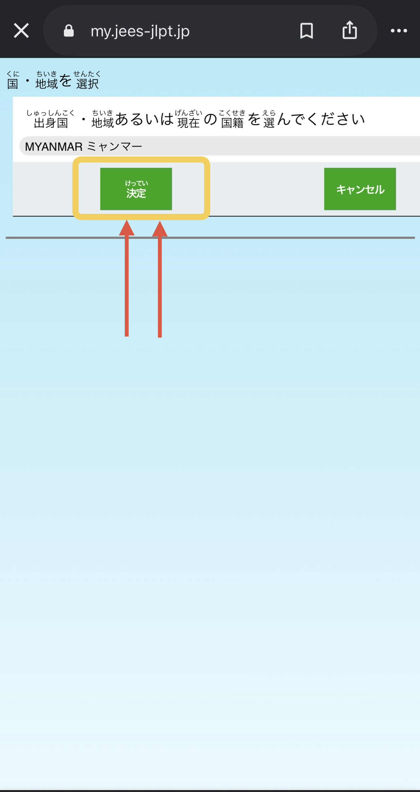

## Step ⑨

မိမိမွေးသက္ကရာဇ်ကို ခုနှစ်၊ လ၊ ရက် အစဉ်ဖြင့်ရွေးချယ်ပါ။
ထို့နောက် အောက်ဘက်ရှိ ၁၆နှစ်ပြည့်ပြီးသူဖြစ်ကြောင်းကို အမှန်ခြစ်ပါ။

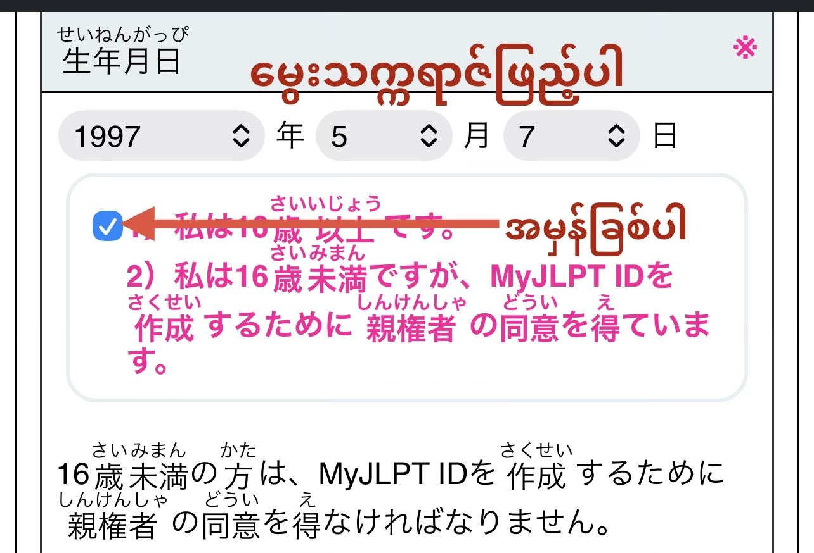

## Step ⑩-1

ဂျပန်တွင်နေထိုင်သည့် မိမိလိပ်စာကိုဖြည့်ရပါမည်။
ပထမဦးစွာ စာတိုက်အမှတ်ကို ဖြည့်ပါ။
ပထမအကွက်တွင် သုံးလုံးနှင့် ဒုတိယအကွက်တွင် ၄လုံးဖြည့်သွင်းပါ။
ဖြည့်ပြီးပါက ပန်းရောင်ခလုတ်ကို နှိပ်ပါ။

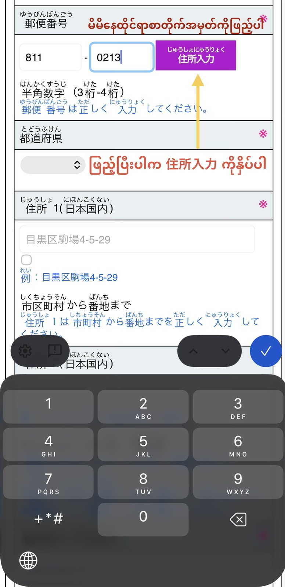

## Step ⑩-2

ပန်းရောင်ခလုတ်နှိပ်လိုက်ပါက ဤ Screen ပေါ်လာပါမည်။
အောက်ဘက်အကွက်တွင်ပေါ်နေသည့် လိပ်စာသည် မိမိလိပ်စာမှန်ကန်ပါက 決定 ဆိုသည့်ခလုတ်ကို ရွေးချယ်ပါ။

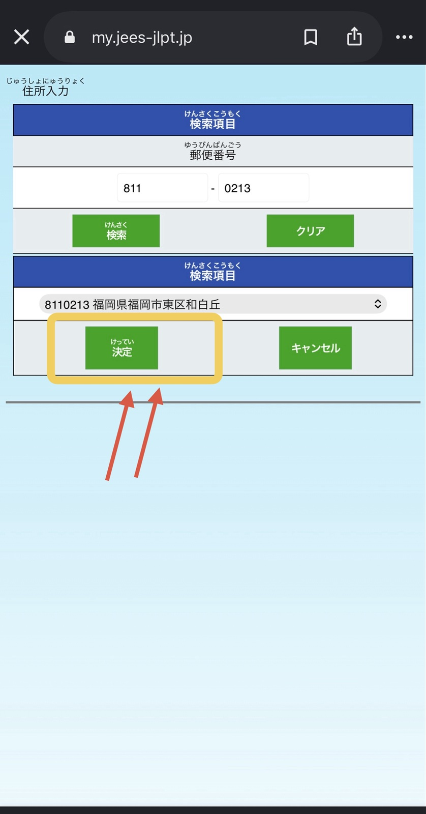

## Step ⑩-3

ခရိုင်က အလိုအလျောက်ရွေးချယ်ပြီးသားဖြစ်နေပါလိမ့်မယ်။ မှန်မမှန်စစ်ဆေးပါ။

住所① မှာ Auto ဝင်နေမည့်လိပ်စာကို 番地 အထိအပြည့်အစုံဖြစ်အောင် ဖြည့်ပါ။

住所② မှာ မိမိနေထိုင်သည့်အဆောက်အအုံအမည်၊ အခန်းနံပါတ်၊ မိမိနာမည်ကိုအနောက်ဘက်တွင် 様方 ထည့်၍ ဖြည့်ပေးပါ။

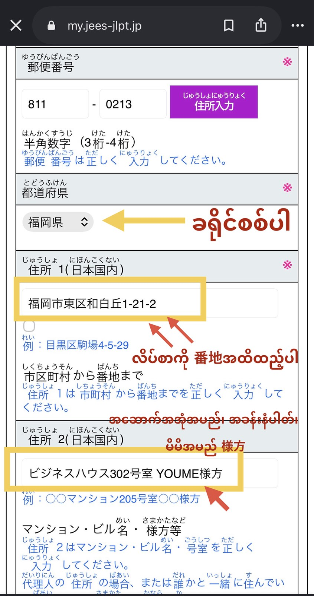

## Step ⑪

ဂျပန်ဖုန်းနံပါတ်၊ Fax နံပါတ်(မရှိပါက မဖြည့်လည်းရပါတယ်)၊ လက်ရှိဖုန်းထဲတွင်သုံးနေသည့် Gmail ကို ၂ ခေါက် ဖြည့်ပေးပါ။

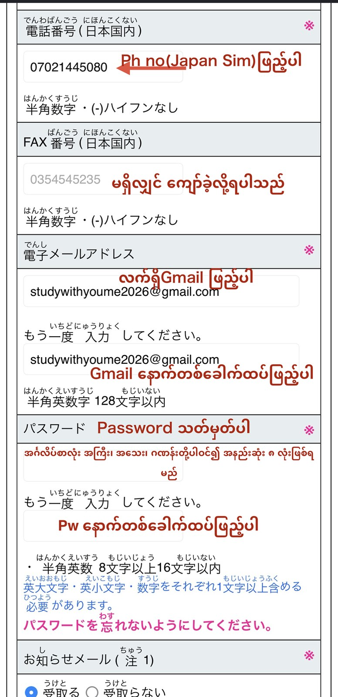

## Step ⑫

Password သတ်မှတ်ပါ။

Password အတွက် စည်းမျဉ်းရှိပါသည်။

အင်္ဂလိပ်စာလုံးအကြီးပါရမည်။ အသေးပါရမည်။ အင်္ဂလိပ်ဂဏန်းပါရမည်။

အထက်ပါသုံးမျိုးပါဝင်၍ အနည်းဆုံး ၈လုံး အများဆုံး ၁၆လုံးထားပေးရပါမည်။

ဥပမာ - Youmepractice20

ထို့နောက် JLPT မှအကြောင်းကြားသည့်မေးလ်များကို လက်ခံမည်လားဆိုသည့်နေရာတွင် 受取る ကိုရွေးချယ်ပါ။

အားလုံး ဖြည့်ပြီးပါက 内容確認する ကိုရွေးချယ်ပါ။

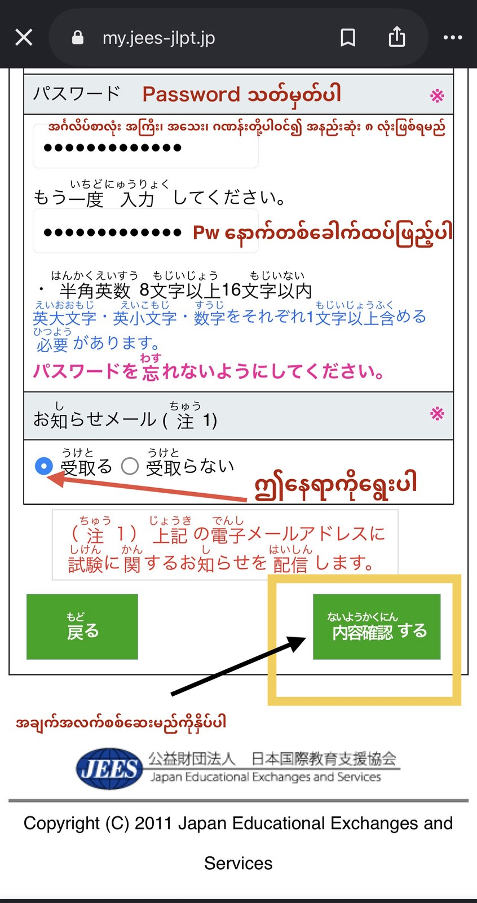

## Step ⑬

မိမိဖြည့်ထားသည့် ကိုယ်ရေးအချက်အလက်များကို သေချာစွာစစ်ဆေးပါ။

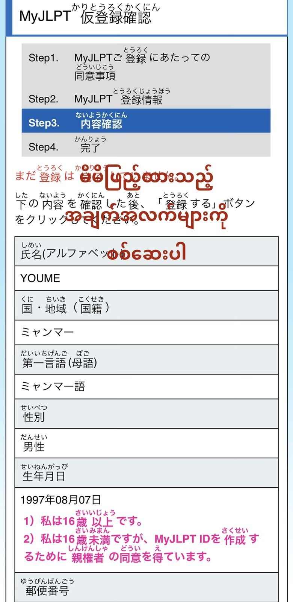

## Step ⑭

အားလုံးစစ်ဆေး၍ပြီးဆုံးပါက 登録する ဆိုသည့်ခလုတ်ကို နှိပ်ပါ။

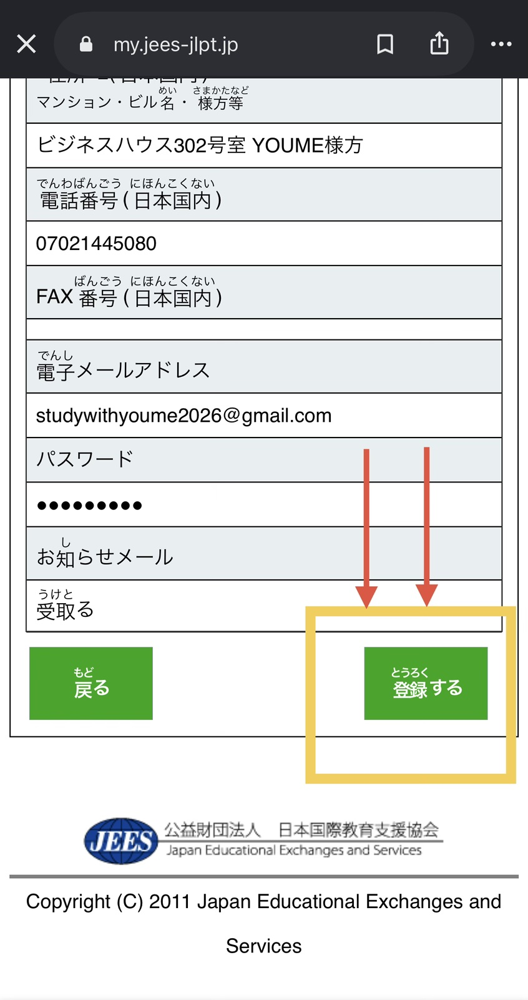

## Step ⑮

URL 送信完了 ဆိုတဲ့ PAGE လေးပေါ်လာပါမည်။

မိမိ register လုပ်ထားသည့် မေးလ်ကို သွားရောက်စစ်ဆေးပါ။

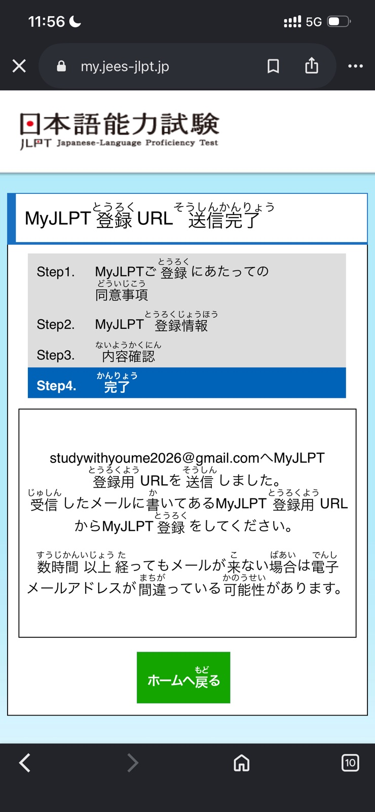

## Step ⑯

myjlpt မှမေးလ်ရောက်နေပါလိမ့်မည်။

URL ထဲသို့ ဝင်ရောက်ပါ။

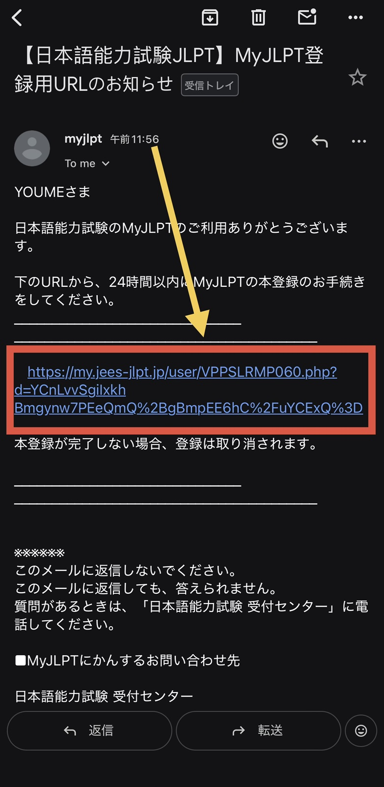

## Step ⑰

အရှေ့တွင်သတ်မှတ်ခဲ့သော password ကိုဖြည့်၍ 送信する ကိုနှိပ်ပါ။

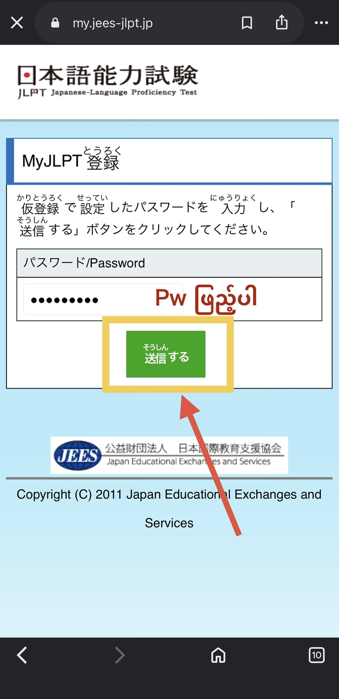

## Step ⑱

မိမိမေးလ်ထဲသို့ myjlpt မှ မေးလ်အသစ်တစ်စောင်ထပ်ရောက်လာပါလိမ့်မည်။

ထိုမေးလ်ထဲမှာ MYJLPT ID ကိုရယူပါ။

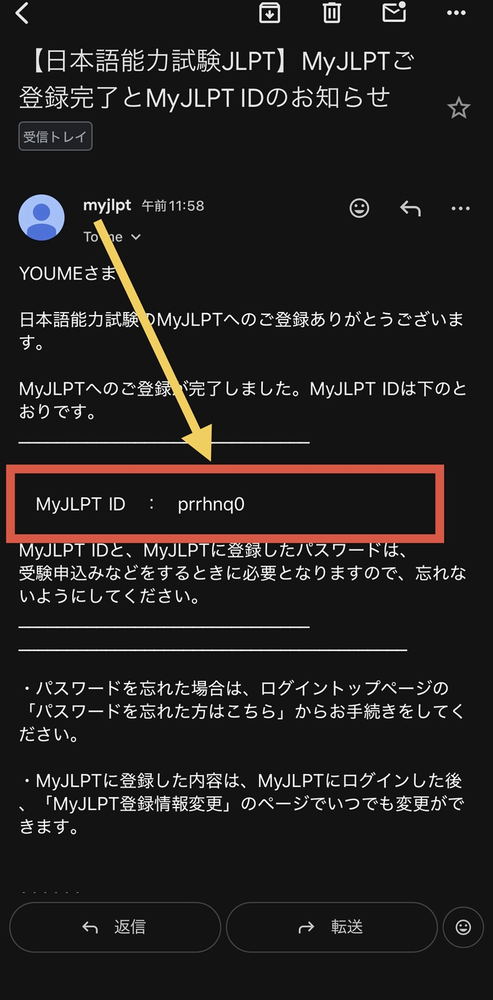

## Step ⑲

JLPT ၏ official website ထဲသို့ ပြန်ဝင်၍ MYJLPT ကို ログイン login ဝင်ပါ။

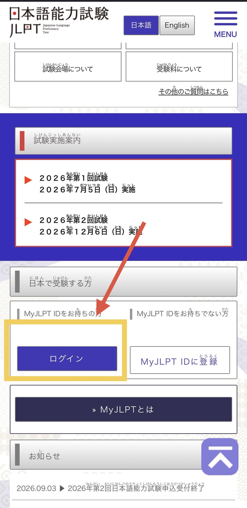

## Step ⑳

မိမိမေးလ်ထဲရောက်ထားသည့် MYJLPT ID နှင့် အရှေ့တွင်သတ်မှတ်ထားသည့် PW တို့ဖြင့် Login ဝင်ပါ။

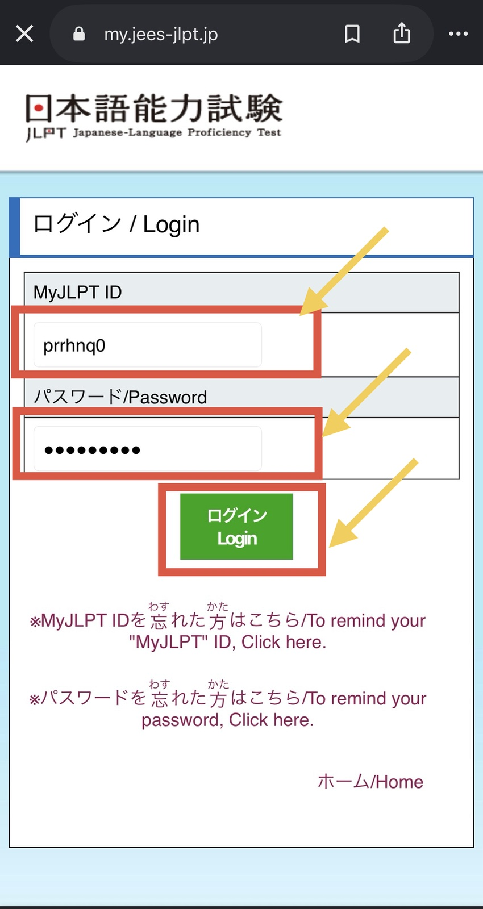

## Step ㉑

မိမိကိုယ်ပိုင် MYJLPT PAGE ထဲသို့ ရောက်သွားပါလိမ့်မည်။ ဒါဆို MyJLPT ID ရပါပြီ ✅

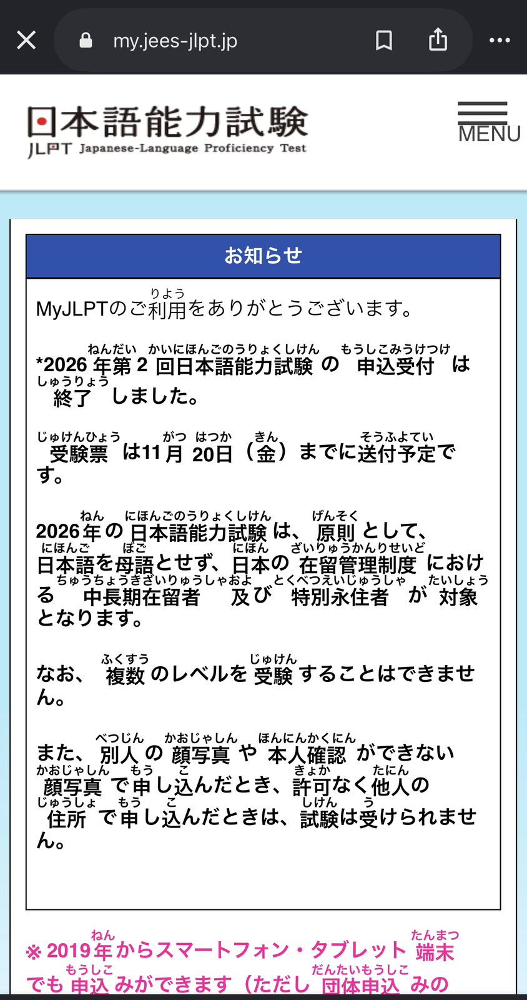

## Step ㉒

MYJLPT PAGE ၏ ညာဘက်ထောင့် MENU bar မှ ဝင်၍ စာမေးပွဲဖောင်တင်ခြင်းများ၊ ဖောင်တင်ပြီးနောက် ကိုယ်ရေးအချက်အလက်များပြောင်းလိုခြင်း၊ စာမေးပွဲအောင်လက်မှတ်ထုတ်ယူလိုခြင်းများကို ပြုလုပ်နိုင်ပါသည်။

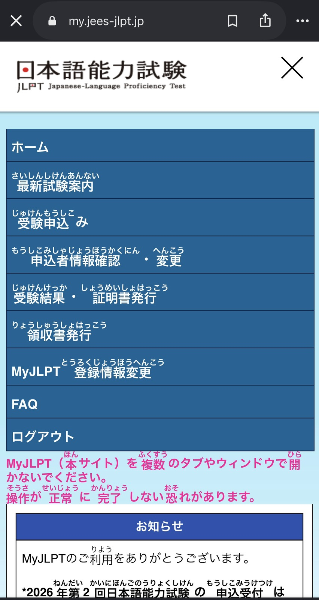

---

## ⚠️ သတိထားရန်

MyJLPT Account ဖွင့်တာနဲ့ JLPT စာမေးပွဲလျှောက်ပြီးတာ မဟုတ်ပါဘူး။

Account ဖွင့်ပြီးနောက်

- 👉 Login ဝင်
- 👉 「受験申込」 ကိုရွေး
- 👉 JLPT Application ဖြည့်
- 👉 စာမေးပွဲကြေး ပေးချေ

ပြီးမှ JLPT လျှောက်ထားမှု ပြီးမြောက်မှာပါ။

📌 MyJLPT ID နဲ့ Password ကို မမေ့အောင် သိမ်းထားပါ။

💡 Tip: JLPT Application ဖွင့်တဲ့အချိန်မှာ Website ကို လူအများဝင်ကြည့်တာကြောင့် အခက်အခဲဖြစ်နိုင်တဲ့အတွက် MyJLPT Account ကို ကြိုဖွင့်ထားတာ ပိုကောင်းပါတယ်။

📌 အသုံးဝင်ရင် 📤 JLPT ဖြေမယ့်သူငယ်ချင်းတွေဆီ Share ပေးပါ ❤️
