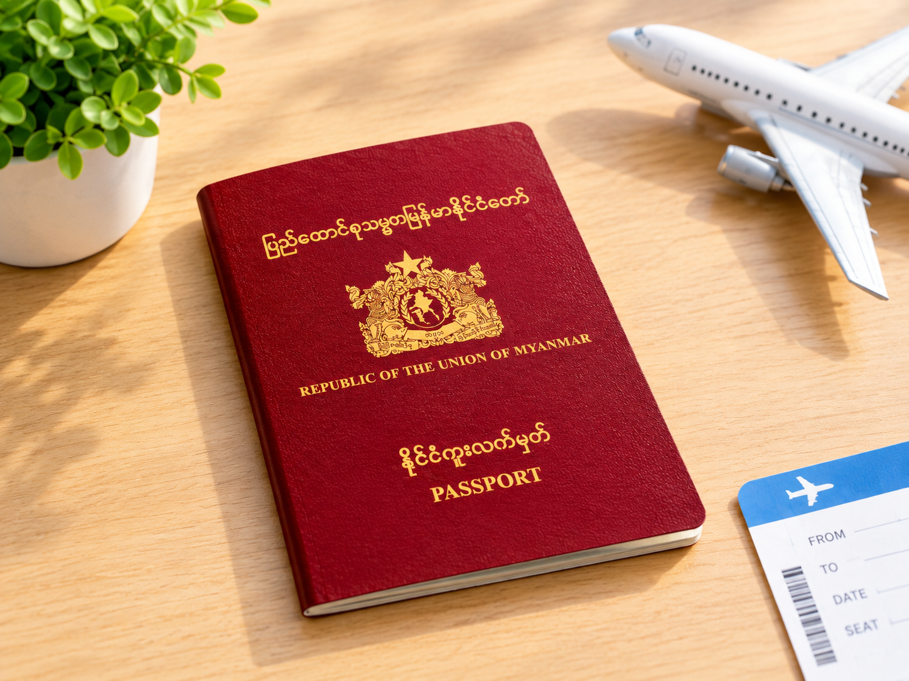
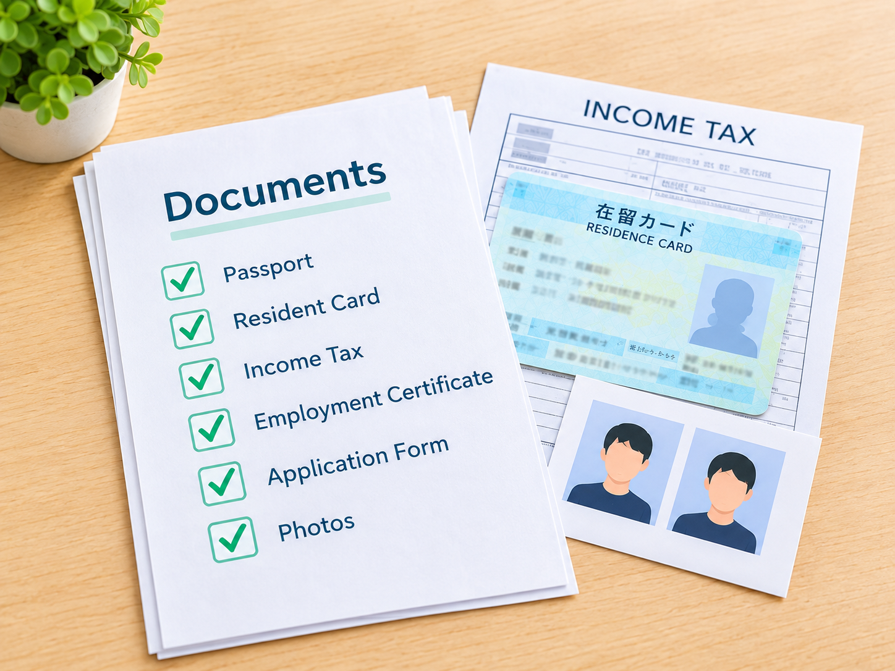
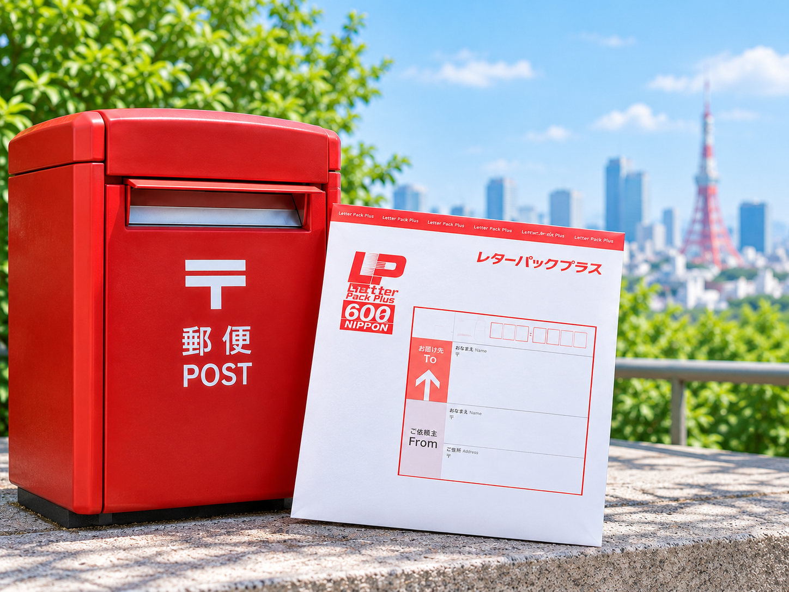

# ဂျပန်နိုင်ငံတွင် မြန်မာ Passport သက်တမ်းတိုးနည်း (PJ Passport)

ဂျပန်နိုင်ငံမှာ အလုပ်လုပ်ကိုင်နေတဲ့ မြန်မာနိုင်ငံသားများအတွက် မြန်မာ Passport သက်တမ်းတိုးရာတွင် လိုအပ်တဲ့ စာရွက်စာတမ်းများ၊ လျှောက်ထားနည်းနဲ့ အရေးကြီးတဲ့ အချက်အလက်တွေကို အဆင့်ဆင့် မျှဝေပေးသွားပါမယ်။

## ပထမဦးစွာ သိထားသင့်သော အချက်များ

### ① မိမိလျှောက်ထားမည့် Passport အမျိုးအစားကို စစ်ဆေးပါ

အလုပ်လုပ်ကိုင်နေသူ၊ ကျောင်းသား၊ မှီခိုသူ စသည်ဖြင့် လျှောက်ထားသူအမျိုးအစားအလိုက် လိုအပ်သော စာရွက်စာတမ်းများ ကွာခြားနိုင်ပါသည်။

အောက်ပါ မြန်မာသံရုံး၏ Official Website တွင် အသေးစိတ်စစ်ဆေးနိုင်ပါတယ်။

[Official Website](https://myanmarembassytokyo.org/consular-services/)

### ② Passport သက်တမ်းကို စစ်ဆေးပါ

စည်းမျဉ်းအရ Passport သက်တမ်း ၆ လနှင့်အောက် ကျန်ရှိသူများအတွက် လျှောက်ထားနိုင်ကြောင်း ဖော်ပြထားပါသည်။

### ③ လျှောက်ထားနည်း ၂ မျိုးရှိပါသည်

- **နည်းလမ်း (၁)** — သံရုံးသို့ ကိုယ်တိုင်သွားရောက်လျှောက်ထားခြင်း
- **နည်းလမ်း (၂)** — စာတိုက်မှတစ်ဆင့် ပေးပို့လျှောက်ထားခြင်း

ဒီတစ်ခေါက်မှာတော့ မင်မင်က ဂျပန်နိုင်ငံမှာ အလုပ်လုပ်ကိုင်နေသူများအတွက် Passport သက်တမ်းတိုးရာတွင် လိုအပ်သော စာရွက်စာတမ်းများကို မျှဝေပေးသွားမှာ ဖြစ်ပါတယ်။

## Step 1 — Passport သက်တမ်းကို စစ်ဆေးပါ

မိမိ၏ Passport သက်တမ်းသည် သတ်မှတ်ထားသော သက်တမ်းကာလအတွင်း ရှိ၊ မရှိ စစ်ဆေးပါ။

Passport သက်တမ်းကုန်ဆုံးမည့်ရက်ကို ကြိုတင်စစ်ဆေးပြီး လိုအပ်သော စာရွက်စာတမ်းများကို အချိန်မီပြင်ဆင်ထားရန် အကြံပြုပါတယ်။

## Step 2 — လျှောက်ထားမည့်နည်းလမ်းကို ရွေးချယ်ပါ

### ① သံရုံးကို ကိုယ်တိုင်သွားရောက်လျှောက်ထားမည်ဆိုပါက

သံရုံး၏ Booking System မှတစ်ဆင့် ကြိုတင်ရက်ချိန်းယူရန် လိုအပ်နိုင်ပါတယ်။

[Booking Link](https://myanmarembassy.setmore.com/)

ကောင်တာ (၁) နှင့် ကောင်တာ (၂) ရှိသောကြောင့် လက်ရှိရရှိနိုင်သော ရက်ချိန်းနှင့် သက်ဆိုင်ရာဝန်ဆောင်မှုကို စစ်ဆေးပြီး လျှောက်ထားပါ။

### ② စာတိုက်မှတစ်ဆင့် လျှောက်ထားမည်ဆိုပါက

Letter Pack ယန်း ၆၀၀ တန်ဖြင့် ပေးပို့လျှောက်ထားနိုင်မည်ဖြစ်ပါသည်။

မင်မင်အနေနဲ့ စာတိုက်မှတစ်ဆင့် လျှောက်ထားတာက အချိန်လည်း save ဖြစ်တာမလို့ ဒီနည်းလမ်းလေးကို recommend လုပ်ချင်ပါတယ်နော်။

## Step 3 — Passport လျှောက်လွှာပုံစံ ဖြည့်စွက်ပါ

Passport လျှောက်လွှာပုံစံကို Download ပြုလုပ်ပြီး လိုအပ်သော အချက်အလက်များကို မှန်ကန်စွာ ဖြည့်စွက်ပါ။

- လျှောက်လွှာတွင် ဓာတ်ပုံကပ်ရန် လိုအပ်ပါသည်။
- လျှောက်လွှာပုံစံတွင် ဖော်ပြထားသော ပူးတွဲတင်ပြရမည့် စာရွက်စာတမ်းများကို သေချာစစ်ဆေးပြီး ပြည့်စုံအောင် ပြင်ဆင်ပါ။

[Passport Application Form](https://myanmarembassytokyo.org/wp-content/uploads/2025/05/consularservice-pdf-02.pdf)

## Step 4 — ကိုယ်ရေးရာဇဝင် (CV) ဖြည့်စွက်ပါ

သံရုံးက သတ်မှတ်ထားသော ကိုယ်ရေးရာဇဝင်ပုံစံကို Download ပြုလုပ်ပြီး လိုအပ်သော အချက်အလက်များကို ဖြည့်စွက်ပါ။

[CV Form](https://myanmarembassytokyo.org/wp-content/uploads/2025/01/CV-form.pdf)

## Step 5 — လက်ရှိ Passport မိတ္တူ

လက်ရှိ Passport စာအုပ်မှ အောက်ပါစာမျက်နှာများကို မိတ္တူကူးယူပါ။

- ဓာတ်ပုံနှင့် ကိုယ်ရေးအချက်အလက်များပါသော ရှေ့စာမျက်နှာ
- တံဆိပ်တုံးများ ထုထားသော စာမျက်နှာများအားလုံး

## Step 6 — Resident Card မိတ္တူ

လက်ရှိ ဂျပန် Resident Card (在留カード) ၏ မိတ္တူ ၁ စုံကို ပြင်ဆင်ပါ။

## Step 7 — ဝင်ငွေခွန် (Income Tax) နှင့် ပတ်သက်သော စာရွက်စာတမ်းများ

- ဝင်ငွေခွန်သည် ဂျပန်နိုင်ငံတွင် အလုပ်လုပ်ကိုင်နေသော မြန်မာနိုင်ငံသားများအားလုံး မြန်မာသံရုံးသို့ ပေးဆောင်ရမည့် အခွန်ဖြစ်ပါသည်။
- ပေးဆောင်ရမည့် ပမာဏမှာ လစာ ယန်း ၁၅၀,၀၀၀ နှင့်အောက် ဖြစ်ပါက တစ်လလျှင် ယန်း ၁,၀၀၀၊ လစာ ယန်း ၂၀၀,၀၀၀ နှင့်အထက် ဖြစ်ပါက တစ်လလျှင် ယန်း ၂,၀၀၀ ပေးဆောင်ရမည်ဖြစ်ပါသည်။ လစာ ယန်း ၁၅၀,၀၀၀ နှင့်အောက် ရရှိသူများအနေဖြင့် ထိုလစာပမာဏကို ရရှိနေကြောင်း အထောက်အထား (ထောက်ခံစာ) လိုအပ်ပါမည်။
- ဝင်ငွေခွန်ကို မပေးဆောင်ရသေးပါက Passport သက်တမ်းတိုးလျှောက်ထားသည့်အခါ ဝင်ငွေခွန်ကို တစ်ပါတည်း ပေးဆောင်ပြီး စာရွက်စာတမ်းများနှင့်အတူ ပူးတွဲတင်ပြထားခြင်းက ပိုမိုအဆင်ပြေပါသည်။
- မိမိဂျပန်နိုင်ငံသို့ ရောက်ရှိသည့်အချိန်မှစ၍ လက်ရှိအချိန်အထိ လများအားလုံးအတွက် ဝင်ငွေခွန် ပေးဆောင်ရမည်ဖြစ်ပါသည်။

ဥပမာ — ၂၀၂၄ ခုနှစ် စက်တင်ဘာလတွင် ဂျပန်နိုင်ငံသို့ ရောက်ရှိပြီး အလုပ်လုပ်ကိုင်နေသူတစ်ဦးသည် ၂၀၂၆ ခုနှစ် စက်တင်ဘာလတွင် Passport သက်တမ်းတိုးလျှောက်ထားမည်ဆိုပါက ၂၄ လစာ ဝင်ငွေခွန် ပေးဆောင်ရမည်ဖြစ်ပါသည်။

ယန်း ၂,၀၀၀ × ၂၄ လ = ယန်း ၄၈,၀၀၀

### ပြင်ဆင်ရန် လိုအပ်သော စာရွက်စာတမ်းများ

1. ဝင်ငွေခွန်ဖောင်
2. နောက်ဆုံးပေးဆောင်ထားသော ဝင်ငွေခွန်ပြေစာ / ဘဏ်ငွေလွှဲအထောက်အထား

[Income Tax Form](https://myanmarembassytokyo.org/wp-content/uploads/2025/01/Tax-Form.pdf)

### ဝင်ငွေခွန်ပေးဆောင်ရန် ဘဏ်အကောင့်

- **Bank:** Sumitomo Mitsui Bank Corporation (SMBC)
- **Branch:** Gotanda Branch
- **Account Type:** Current Account（当座）
- **Account No.:** 4035008
- **Account Name:** MyanmarEmbassy
- **Tel:** 03-3441-9291

> **အရေးကြီးသတိပြုရန်**
>
> ဘဏ်အကောင့်အချက်အလက်များကိုလည်း လက်ရှိ Official Website သို့မဟုတ် သံရုံးထံမှ အတည်ပြုပြီးမှ အသုံးပြုပါ။

အထက်ဖော်ပြပါ ဝင်ငွေခွန်ဖောင်ပုံစံနှင့် ဘဏ်အကောင့်သို့ ငွေလွှဲပေးချေထားကြောင်း အထောက်အထား (ဘဏ်ချလန်) ကို Passport သက်တမ်းတိုးလျှောက်ထားသည့်အခါ တစ်ပါတည်း ပူးတွဲတင်ပြရမည်ဖြစ်ပါသည်။

## Step 8 — အလုပ်ထောက်ခံစာ (在籍証明書)

မိမိအလုပ်လုပ်ကိုင်နေသော ကုမ္ပဏီထံမှ အလုပ်လုပ်ကိုင်နေကြောင်း အတည်ပြုစာ (在籍証明書) ကို တောင်းခံပြင်ဆင်ပါ။

သတ်မှတ်ထားသော ပုံစံမရှိသောကြောင့် ကုမ္ပဏီဘက်မှ 在籍証明書 ထုတ်ပေးသော ပုံစံဖြင့် အဆင်ပြေပါသည်။

## Step 9 — Passport သက်တမ်းတိုးခ

လက်ရှိ Passport သက်တမ်းတိုးခသည် ယန်း ၆,၀၀၀ ဖြစ်ပါသည်။

### ပေးဆောင်ရန် ဘဏ်အကောင့်

- **Bank:** Sumitomo Mitsui Bank Corporation (SMBC)
- **Branch:** Gotanda Branch
- **Account Type:** Current Account（当座）
- **Account No.:** 4035008
- **Account Name:** MyanmarEmbassy
- **Tel:** 03-3441-9291

> **အရေးကြီးသတိပြုရန်**
>
> ဘဏ်အကောင့်အချက်အလက်များကိုလည်း လက်ရှိ Official Website သို့မဟုတ် သံရုံးထံမှ အတည်ပြုပြီးမှ အသုံးပြုပါ။

ငွေပေးချေပြီးပါက ဘဏ်ချလန်မူရင်း ပူးတွဲတင်ပြပါ။

## Step 10 — လက်ဗွေပုံစံ

စာတိုက်မှတစ်ဆင့် လျှောက်ထားသူများအတွက် လက်ဗွေပုံစံ လိုအပ်ပါသည်။

[Fingerprint Form](https://myanmarembassytokyo.org/wp-content/uploads/2025/05/consularservice-12.pdf)

လက်ဗွေပုံစံကို ဖြည့်စွက်ရာတွင် သံရုံး၏ လက်ရှိညွှန်ကြားချက်များကို လိုက်နာပါ။

## Step 11 — Passport မူရင်း ပေးပို့ခြင်း

စာတိုက်မှတစ်ဆင့် လျှောက်ထားသူများအတွက် Passport မူရင်း ပေးပို့ရန် လိုအပ်ပါသည်။

## Step 12 — Letter Pack ဖြင့် စာတိုက်မှ ပေးပို့လျှောက်ထားခြင်း

စာတိုက်မှတစ်ဆင့် လျှောက်ထားမည့်သူများသည် သံရုံး၏ လက်ရှိညွှန်ကြားချက်အတိုင်း လိုအပ်သော စာရွက်စာတမ်းများနှင့် ပြန်လည်ပို့ဆောင်ရန် စာအိတ်ကို ပြင်ဆင်ပါ။

Letter Pack ၂ ခု လိုအပ်ကြောင်း ဖော်ပြထားပါသည်။

### ပြင်ဆင်ရန် အချက်များ

1. သံရုံးသို့ ပေးပို့ရန် Letter Pack ယန်း 600 တန်(အနီရောင်) (To တွင် သံရုံးလိပ်စာ၊ From တွင် မိမိလိပ်စာ) ဤ Letter Pack ထဲတွင် အထက်ပါစာရွက်စာတမ်းများအားလုံးနှင့် အသစ်ပြန်လည်ပေးပို့ရန် Letter Pack အသစ်တစ်ခုထည့်ပေးလိုက်ရန် လိုအပ်ပါသည်။
2. Passport အသစ် ပြန်လည်ပို့ပေးရန်အတွက် Letter Pack ယန်း 600 တန်(အနီရောင်) (To တွင် မိမိလိပ်စာ၊ From တွင် သံရုံးလိပ်စာ)
3. Letter Pack တွင် မိမိ၏ အမည်၊ လိပ်စာနှင့် ဖုန်းနံပါတ်တို့ကို မှန်ကန်စွာ ဖြည့်စွက်ပါ။

### သံရုံးလိပ်စာ

140-0001

4-8-26, Kita Shinagawa, Shinagawa Ku, Tokyo 140-0001

Myanmar Embassy, Tokyo

Consular Section (Passport သက်တမ်းတိုး)

[Official Website](https://myanmarembassytokyo.org/)

## Passport အသစ် ပြန်လည်ရရှိမည့်အချိန်

စာတိုက်မှ ပေးပို့လျှောက်ထားပြီးနောက် ခန့်မှန်းခြေ ၁ လခန့်အကြာတွင် Passport အသစ်ကို ပြန်လည်ရရှိနိုင်ပါသည်။

သို့သော် လုပ်ငန်းစဉ်ကြာချိန်သည် လျှောက်ထားမှုအရေအတွက်၊ စာရွက်စာတမ်းပြည့်စုံမှုနှင့် သံရုံး၏ လက်ရှိလုပ်ငန်းစဉ်များအပေါ် မူတည်နိုင်သောကြောင့် တိကျသောအချိန်ကို သံရုံးထံ အတည်ပြုပါ။

## နောက်ဆုံးအနေဖြင့်

Passport သက်တမ်းတိုးရန် စီစဉ်နေသူများအနေဖြင့် မိမိ၏ Passport သက်တမ်းကုန်ဆုံးမည့်ရက်ကို ကြိုတင်စစ်ဆေးပြီး လိုအပ်သော စာရွက်စာတမ်းများကို အချိန်မီ ပြင်ဆင်ထားကြပါနော်။

ဒီ Post လေးက Passport သက်တမ်းတိုးရန် စီစဉ်နေတဲ့ မိတ်ဆွေများအတွက် အထောက်အကူဖြစ်မယ်လို့ မျှော်လင့်ပါတယ်။

အားလုံးပဲ အဆင်ပြေကြပါစေ။
